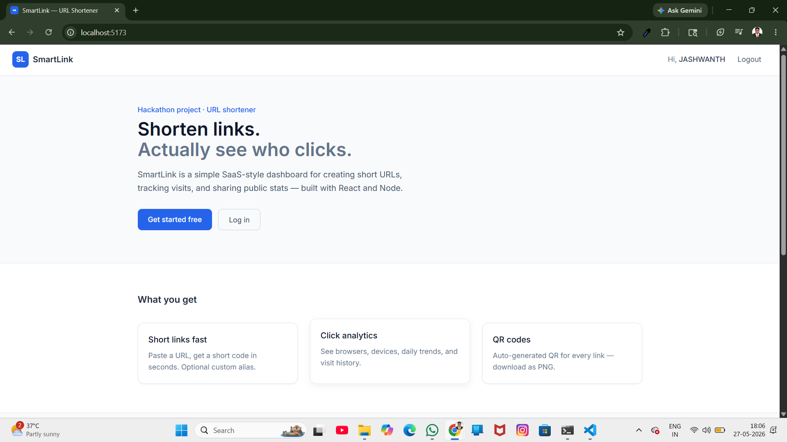
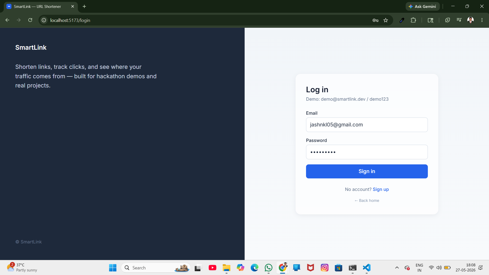
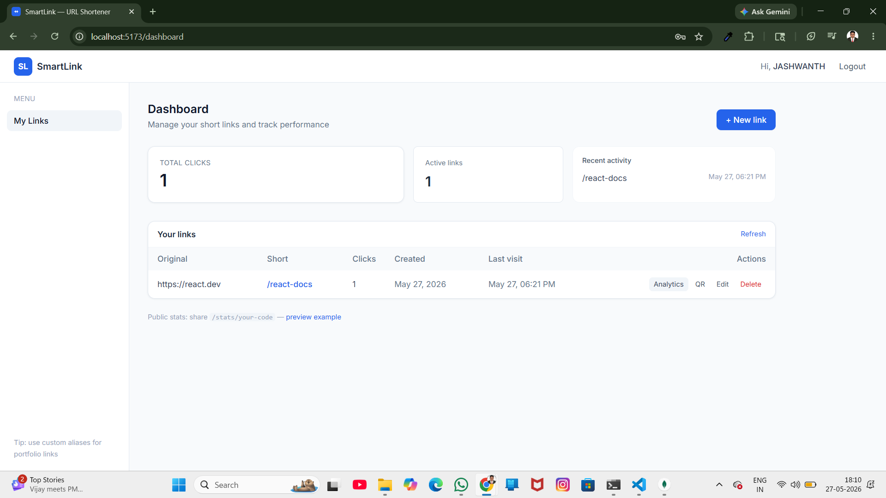
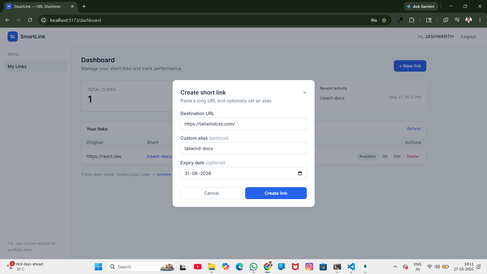
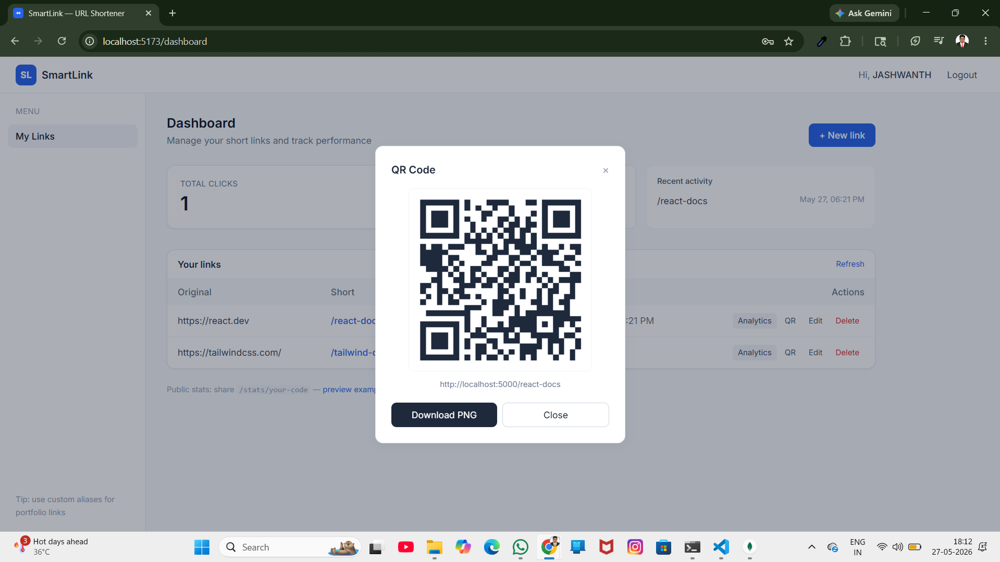
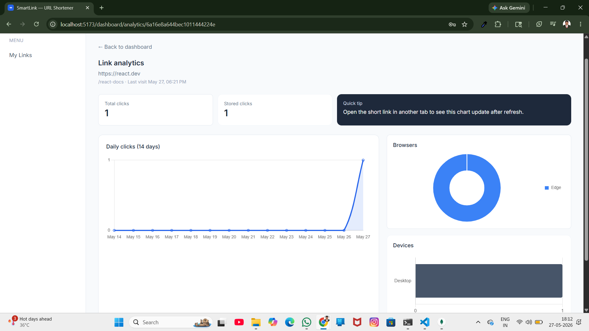
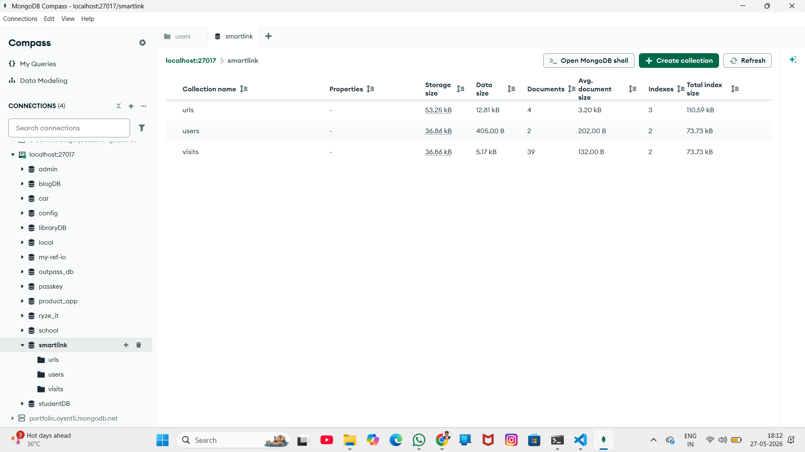

# SmartLink — URL Shortener with Analytics Dashboard

SmartLink is a full-stack URL shortener built for a hackathon project. You can create short links with optional custom aliases, track clicks with browser/device analytics, generate QR codes, and share a public stats page — all from a practical SaaS-style dashboard.

**Demo video:** https://drive.google.com/file/d/1qXFhrtCnw5Z7wqfCLMhK8kaRt18pqUXo/view?usp=sharing

---

## Project Overview

### Live Features Demonstrated
- JWT Authentication
- URL Shortening
- QR Code Generation
- Real-Time Analytics
- Browser & Device Tracking
- Public Stats Page
- MongoDB Analytics Storage

Most link shorteners hide analytics behind paid tiers. SmartLink focuses on what matters for a portfolio demo: fast link creation, a clean dashboard, and charts that update when someone clicks your link. The UI is intentionally simple — slate tones, one blue accent, mixed card sizes — so it feels like something a student refined over a few days, not a generic AI template.

---

## Features

### Authentication
- Signup & login with JWT
- Protected dashboard routes
- Persistent session (localStorage + token refresh via `/me`)
- Logout

### URL Shortening
- Create short URLs with validation
- Custom aliases
- QR code generation (view + PNG download)
- Optional expiry date
- Edit destination URL
- Delete links
- One-click copy

### Dashboard
- Overview cards (total clicks, active links)
- Recent activity list
- URL table with actions

### Analytics
- Total clicks & click history
- Browser and device breakdown
- 14-day daily trend chart (Chart.js)
- Per-link analytics page

### Bonus
- Public stats page (`/stats/:shortCode`)
- Loading skeletons
- Toast notifications
- Realistic empty states
- Sample seed data

---

## Tech Stack

| Layer | Tools |
|-------|--------|
| Frontend | React, Vite, React Router, Axios, Context API, Tailwind CSS, Chart.js |
| Backend | Node.js, Express, MongoDB, Mongoose |
| Auth | JWT, bcrypt |
| Utilities | dotenv, nanoid, qrcode, validator |

---

## Screenshots

### Landing Page
> Clean homepage with feature overview and modern SaaS-style layout.



---

### Login Page
> JWT-based authentication with protected routes.



---

### Dashboard
> User dashboard showing shortened URLs, click counts, and actions.



---

### URL Creation
> Creating a short URL with custom alias and expiry date.



---

### QR Code Feature
> Automatically generated QR code for each shortened link.



---

### Analytics Dashboard
> Real-time analytics including clicks, browser/device tracking, and charts.



---

### MongoDB Collections
> MongoDB collections storing users, URLs, and visit analytics.



---

## Folder Structure

```
smartlink/
├── frontend/
│   └── src/
│       ├── pages/          # Landing, Login, Dashboard, Analytics, etc.
│       ├── components/     # Navbar, UrlTable, modals, charts
│       ├── context/        # Auth + Toast
│       ├── layouts/        # Dashboard shell
│       ├── services/       # API wrappers
│       └── utils/
├── backend/
│   ├── controllers/
│   ├── models/
│   ├── routes/
│   ├── middleware/
│   ├── services/
│   ├── config/
│   └── utils/
├── README.md
├── architecture.md
├── API_DOCUMENTATION.md
├── screenshots
└── sample.env
```

---

## Setup Instructions

### Prerequisites
- Node.js 18+
- MongoDB (local or Atlas)

### 1. Clone & install

```bash
cd backend
npm install
cp .env.example .env
# edit .env with your MongoDB URI and JWT_SECRET

cd ../frontend
npm install
cp .env.example .env
```

### 2. Run MongoDB

Local: start `mongod`, or use MongoDB Atlas connection string in `MONGODB_URI`.

### 3. Seed demo data (optional)

```bash
cd backend
npm run seed
```

Login: `demo@smartlink.dev` / `demo123`

### 4. Start servers

```bash
# Terminal 1
cd backend
npm run dev

# Terminal 2
cd frontend
npm run dev
```

- Frontend: http://localhost:5173  
- Backend: http://localhost:5000  

---

## Demo Credentials

```txt
Email: demo@smartlink.dev
Password: demo123
```

---

## Environment Variables

See `sample.env` for a combined reference.

**Backend (`backend/.env`):**
| Variable | Description |
|----------|-------------|
| `PORT` | API port (default 5000) |
| `MONGODB_URI` | MongoDB connection string |
| `JWT_SECRET` | Secret for signing tokens |
| `JWT_EXPIRE` | Token expiry (e.g. `7d`) |
| `FRONTEND_URL` | CORS origin |
| `BASE_URL` | Used in short URLs & QR |

**Frontend (`frontend/.env`):**
| Variable | Description |
|----------|-------------|
| `VITE_API_URL` | API base (e.g. `http://localhost:5000/api`) |

---

## API Endpoints

| Method | Endpoint | Auth | Description |
|--------|----------|------|-------------|
| POST | `/api/auth/register` | No | Create account |
| POST | `/api/auth/login` | No | Login |
| GET | `/api/auth/me` | Yes | Current user |
| POST | `/api/url/create` | Yes | Create short URL |
| GET | `/api/url/myurls` | Yes | List user's URLs |
| PUT | `/api/url/:id` | Yes | Update URL |
| DELETE | `/api/url/:id` | Yes | Delete URL |
| GET | `/api/url/public/:shortCode` | No | Public stats |
| GET | `/api/analytics/:id` | Yes | Full analytics |
| GET | `/:shortCode` | No | Redirect + track visit |

Full details: [API_DOCUMENTATION.md](./API_DOCUMENTATION.md)

---

## Architecture Explanation

- **Frontend** talks to Express via Axios. Auth token is stored in `localStorage` and attached by an interceptor.
- **Backend** uses a classic MVC-style split: routes → controllers → models/services.
- **Redirects** happen on `GET /:shortCode`, which increments clicks, logs a `Visit`, then redirects.
- **Analytics** are computed from the `Visit` collection (not just the click counter).

See [architecture.md](./architecture.md) for diagrams and data flow.

---

## AI Planning Workflow

This project was planned in phases before coding:

1. **Requirements pass** — Map hackathon PDF features to routes and pages.
2. **Data model sketch** — User, Url, Visit collections and relationships.
3. **API contract** — Define endpoints and response shapes first.
4. **UI wireframe (mental)** — Dashboard layout with asymmetric cards, not a symmetric grid.
5. **Implementation order** — Auth → URL CRUD → redirect tracking → analytics → polish (toasts, skeletons, public page).
6. **Humanization review** — Reduce reusable abstractions, vary spacing, keep naming practical.

AI assisted with boilerplate and docs; layout choices, naming, and styling were directed to feel hand-built.

---

## Challenges Faced

- **Route ordering** — Short-code redirect `/:shortCode` must not swallow `/api` routes; guarded in `server.js`.
- **Click vs visit count** — `Url.clicks` is denormalized for fast dashboard reads; `Visit` stores rich analytics.
- **CORS + deployment** — Separate frontend/backend URLs require env updates on Vercel and Render.
- **QR storage** — Stored as data URL in MongoDB for simplicity (trade-off: document size).

---

## Future Improvements

- Custom domains per user
- Team workspaces
- Rate limiting on redirect endpoint
- GeoIP for country stats
- Email reports for weekly click summaries
- Redis cache for high-traffic redirects

---

## Deployment

### MongoDB Atlas
1. Create free cluster → Database → Connect → copy URI.
2. Add `0.0.0.0/0` to Network Access for hackathon demo (tighten for production).
3. Put URI in Render env as `MONGODB_URI`.

### Render (backend)
1. New Web Service → connect repo → root: `backend`.
2. Build: `npm install` · Start: `npm start`.
3. Env: `MONGODB_URI`, `JWT_SECRET`, `FRONTEND_URL` (Vercel URL), `BASE_URL` (Render URL).
4. Health check: `/api/health`.

### Vercel (frontend)
1. Import repo → root: `frontend`.
2. Env: `VITE_API_URL=https://your-api.onrender.com/api`.
3. Deploy.

Update `FRONTEND_URL` on backend after Vercel deploy.
---

## Video Walkthrough

Demo Video:
https://drive.google.com/file/d/1qXFhrtCnw5Z7wqfCLMhK8kaRt18pqUXo/view?usp=sharing

The demo showcases:
- Authentication flow
- URL shortening
- QR code generation
- Real-time analytics tracking
- MongoDB data storage
- Backend routing and redirects

---

This project is a part of a hackathon run by https://katomaran.com
